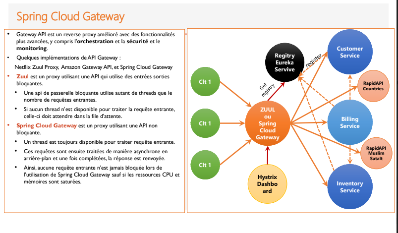
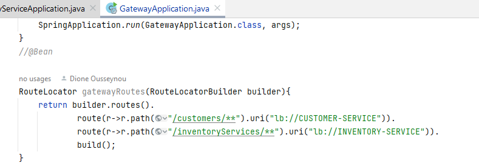
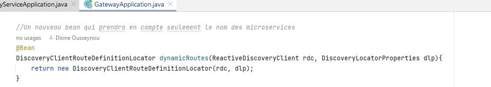
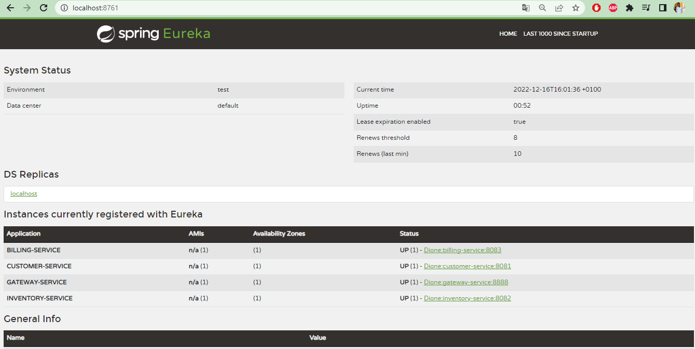
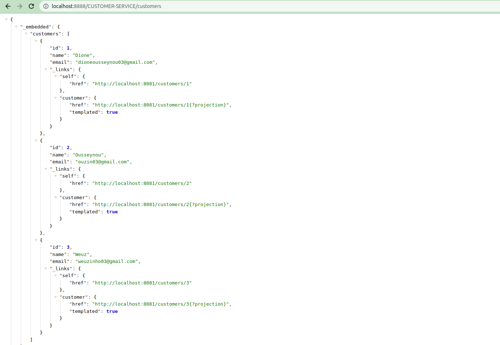
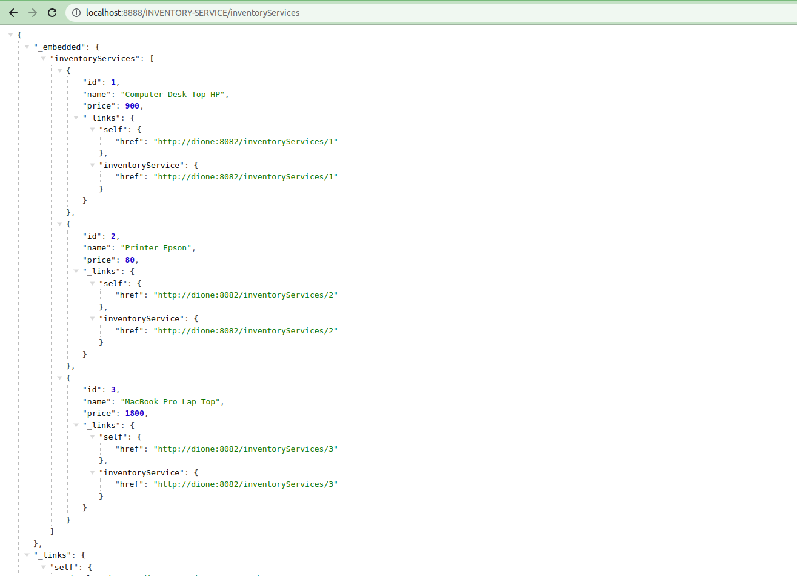
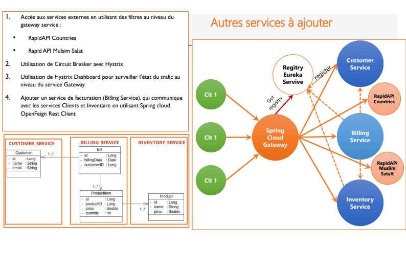
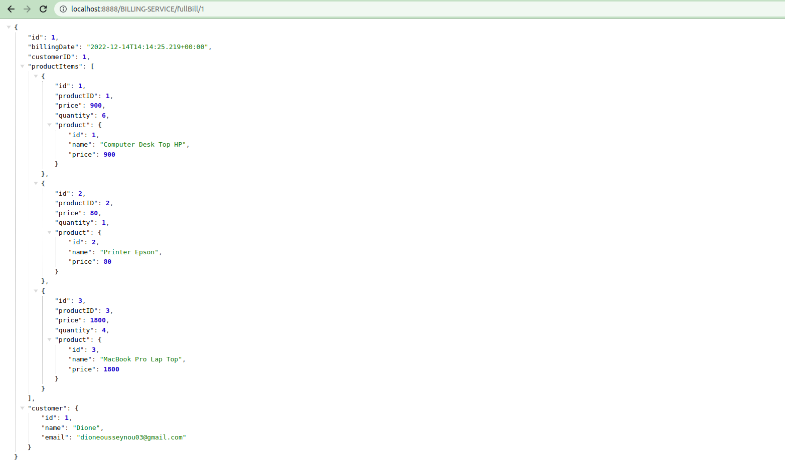

<h1>Micro Servive application Ecomm</h1>
<h2>Travail demandé</h2>
Objectif :  
Créer une application basée sur une architecture micro-service qui permet de gérer les factures contenant des produits et appartenant à un client.
Travail à faire :

1.Créer le micro-service customer-service qui permet de gérer les client

2.Créer le micro-service inventory-service qui permet de gérer les produits
3. Créer la Gateway Spring cloud Gateway
4. Configuration statique du système de routage
5. Créer l'annuaire Eureka Discrovery Service
6. Faire une configuration dynamique des routes de la gateway
7. Créer le service de facturation Billing-Service en utilisant Open Feign
8. Créer un client Web Angular (Clients, Produits, Factures)
9. Déployer le serveur keycloak :
     - Créer un Realm
     - Créer un client à sécuriser
     - Créer des utilisateurs
     - Créer des rôles
     - Affecter les rôles aux utilisateurs
     - Tester les différents modes d'authentification avec Postman en montrant les contenus de Access-Token, Refresh Token 
9. Sécuriser les micro-services et le frontend angular en déployant les adaptateurs Keycloak
10. Ajouter des Fonctionnalités supplémentaires de votre choix
11. Livrable : Un Repository Github contenant :
   - Le code sources de l'ensemble des micro-services et du frontend
   - Le rapport montrant les différentes étapes dans le fichier README.MD

<h2>Archtecture Spring Cloud de l'application</h2>

L'un des enjeux majeurs du concept de microservice est la communication entre les différents microservices.
La Gateway communique directement avec Eureka qui enregistre tous les micro-services que regroupe l'application.
Il serai aussi possible pour la gateway d'effectuer une configuration statique pour enregistrer tous les srvices en son sein.
comme on peut l'appercevoir ci-aprés : 

Mais c'est une solution trés rigide si on a des dizaines de services.
C'est solution est trés minimaliste: 

On crée alors la discovery qui va stocker chaque instance de micro-service.

Aprés que la gateway a rassemblé tous les micro-services on peut la sortie des API RESTFUL pour customer, product et billing :

<h4>API REST CUSTOMERS</h4>

<h4>API REST INVENTORY</h4>

Le microservice billing-service étant intégré bien aprés et ayant une relation entre les deux services cités présédemment, nécessite une API qui pourra établir la communication entre eux d'aprés l'architecture suivant :

Cette API est @Feign. Elle permet la communication entre les différentes entités des bases de données.

<h4>API REST BILLING</h4>

Par <a href="https://github.com/Ousseynou03/uiMicroserviceAppEcomm.git">ICI</a> pour l'illustration architecturale et la mise en place du client angular. 

